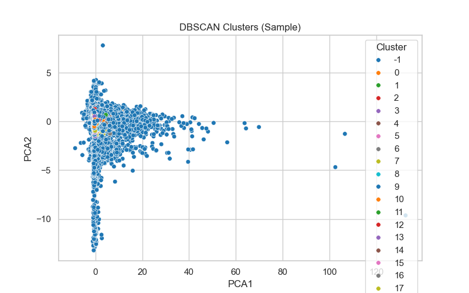

# 💥 DBSCAN-Based Anomaly Detection App

This project uses **DBSCAN clustering** for unsupervised anomaly detection on transaction data, such as the [Credit Card Fraud Detection dataset](https://www.kaggle.com/mlg-ulb/creditcardfraud). It includes:

- A trained `StandardScaler`
- A `Streamlit` web app for interactive detection
- PCA-based 2D visualization
- Downloadable cluster predictions

---

## 📂 Project Structure

```
anomaly-detection/
├── app.py                      # Streamlit app
├── scaler.pkl                 # Trained StandardScaler
├── dbscan_sample_clusters.png # Sample cluster plot
├── AnomalyDetection.ipynb     # Notebook used for preprocessing & saving artifacts
├── requirements.txt           # Python dependencies
├── README.md                  # This file
```

---

## 🚀 Features

✅ Upload CSV with columns `V1` to `V28` + `Amount`  
✅ Data scaling with pre-fitted `StandardScaler`  
✅ Live DBSCAN clustering (no model loading needed)  
✅ PCA-reduced 2D cluster visualization  
✅ Anomaly detection (Cluster `-1`)  
✅ Download clustered dataset  
✅ Optional sample plot preview

---

## 🔧 Setup Instructions

### 1. Clone the Repo

```bash
git clone https://github.com/your-username/anomaly-detection-app.git
cd anomaly-detection-app
```

### 2. Create Virtual Environment (optional)

```bash
python -m venv venv
source venv/bin/activate  # on Windows: venv\Scripts\activate
```

### 3. Install Dependencies

```bash
pip install -r requirements.txt
```

### 4. Run the App

```bash
streamlit run app.py
```

---

## 🧪 Input Data Format

Make sure your CSV file has the following:

- Columns: `V1, V2, ..., V28, Amount`
- No missing or non-numeric values
- `Time` and `Class` columns (if present) are ignored automatically

---

## 📉 Sample Output

| Cluster | Count |
|---------|-------|
| 0       | 4791  |
| -1      | 135   |
| 1       | 23    |

- `-1` = outliers (anomalies)
- The rest = detected clusters

---

## 📸 Preview



---

## 🧠 How It Works

1. **Scaler** (`scaler.pkl`) was trained in `AnomalyDetection.ipynb`
2. **Streamlit app**:
   - Preprocesses uploaded data
   - Scales it using saved scaler
   - Applies DBSCAN (`eps=1.5`, `min_samples=5`) live
   - Visualizes using PCA (2D)

---

## 📥 Download Output

Once processed, the app gives a downloadable file:

```
clustered_output.csv
```

With the added `Cluster` column showing DBSCAN result.

---

## 📌 License

This project is open-source under the [MIT License](LICENSE).

---

## 🙌 Acknowledgments

- [Kaggle Credit Card Dataset](https://www.kaggle.com/mlg-ulb/creditcardfraud)
- Scikit-learn, Streamlit, Matplotlib, Seaborn

---

## ✨ Author

**Kush Bansal**  
📧 [Contact on LinkedIn](https://www.linkedin.com/in/kush-bansal21/)
